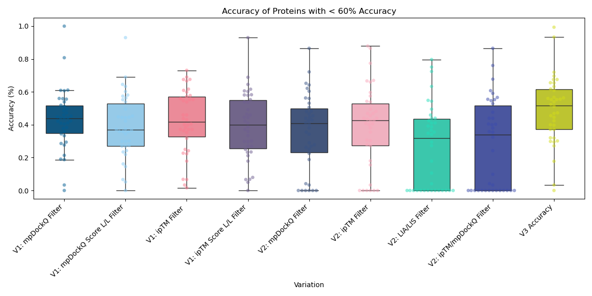

# Frag-AF
A clustering model trained in discovering small inhibitory peptide binders, also known as dominant negative fragments (DNFs), as a high throughput method to understand protein function. 

## Abstract
Peptide tiling is a method in which small segments of a protein interactor are screened to identify fragments capable of exerting a regulatory function, such as inhibition. One of the challenges of this approach is that—due to the vast size of the protein sequence space—screening large libraries of fragments for potential interactors is often prohibitied by time, cost, or resources. New protein structure prediction technologies, such as Google DeepMind's AlphaFold, have the potential to decrease experimental hurdles by allowing researchers to focus on highly confident interacting areas.

In this study, we developed an XGBoost-based classification model to identify dominant negative protein fragments with regulatory potential. The model was trained on features including number of polar residues at the interface, contact pairs, scoring coefficients, and AlphaFold confidence metrics. We applied Synthetic Minority Over-sampling Technique (SMOTE) to address class imbalance challenges and optimized model parameters through grid search cross-validation. 

The resulting classifier achieved 82% overall accuracy with an F1-score of 0.82. We validated our approach by testing the model on 50 novel metabolic proteins, demonstrating its potential to accelerate the discovery of bioactive peptide fragments while reducing experimental costs. This computational pre-screening tool represents a significant advancement in rational protein fragment design, offering researchers a method to prioritize candidates for experimental validation in therapeutic development pipelines.


## What are the different variations?
Multiple variations and different metrics were tested in exploring these dominant negative fragments. We used previous [data](https://www.cell.com/cell-systems/pdfExtended/S2405-4712(21)00157-5) to test and validate the different variations and metrics. 

In order to explore binding of dominant negative fragments, we implemented the [AlphaPulldown (v.0.30.7)](https://academic.oup.com/bioinformatics/article/39/1/btac749/6839971) Pipeline using a ColabFold Search v1.5.5 for multiple sequence alignments. 

We created this [code](pipeline/tiling_protein.py) to tile the protein with 60 amino acid tiles and 10 amino acid sliding window. 

**Our Trained Model**

In order to train the model on "good" data, we wanted to curate the dataset to ensure we are gaining accurate and percise results. With that in mind, we cleaned our database using several parameters: retaining only proteins from the latest variations, metrics with an average accuracy above 60%, and entries with sufficiently large interaction areas (n=51 tiled proteins). The remaining 38 proteins that were not placed in the database were processed and predicted in the trained model, averaging an accuracy of ~55%.




**How to run:**
```bash
python3 tiling_protein.py -uniprot_id uniprot_id_of_protein -directory path/and/name/of/file
```

[Click Here](sbatch_files_example/) to see AlphaPulldown pipeline.  

### Variation 1
In this variation, we correlated previously known metrics to previous data. We explored four metrics: Local Interaction Area, Local Interaction Score, mpDockQ, and ipTM. 

[Click Here](variation_1) to get the codes and information

### Variation 2
In this variation, we used acceptable thresholding metrics to filter fragments and then cluster the items based on different structural and AlphaFold metrics. We adopted various avenues to predict DNFs. We decided to use single thresholds of just ipTM and mpDockQ or dual thresholds employing LIA and LIS or mpDockQ and ipTM. We saw that there is some predictive power in the metrics; however, the precision lacks strength. Therefore, we sought to cluster the data to increase precision. 

[Click Here](variation_2) to get the codes and information. 

### Variation 3 
In this variation, we created a trained classification machine learning model based on previous data. According to previous variations and models, the best metric for increasing signal to noise ratio is ipTM alone as a threshold in terms of [accuracy and percision](variation_3/README.md) for a multitiude of protein.

[Click Here](variation_3) to get the codes and information. 

## Declaration of generative AI usage
This project utilized OpenAI's ChatGPT to assist in generating Python code, documentation, or other textual content.

---

## References
- Ford, K. et al. *Peptide-tiling screens of cancer drivers reveal oncogenic protein domains and associated peptide inhibitors.* **Cell Systems,** 12, (2021) [Paper Link](https://doi.org/10.1016/j.cels.2021.05.002)

- Yu, D. et al. *AlphaPulldown—a Python package for protein–protein interaction screens using AlphaFold-Multimer*, **Bioinformatics**, 39(1), (2023) [Paper Link](https://doi.org/10.1093/bioinformatics/btac749)

> This work utilized the computational resources of the [NIH HPC Biowulf cluster](https://hpc.nih.gov).
