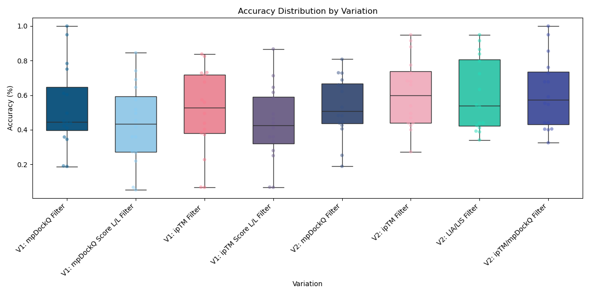
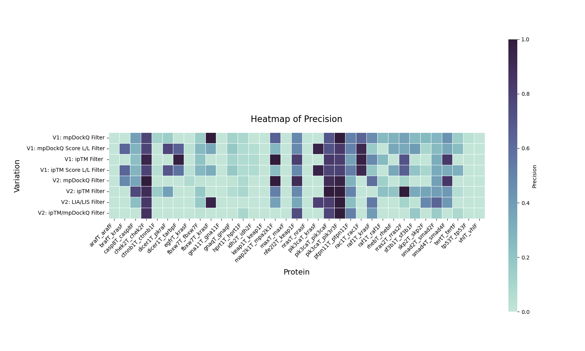
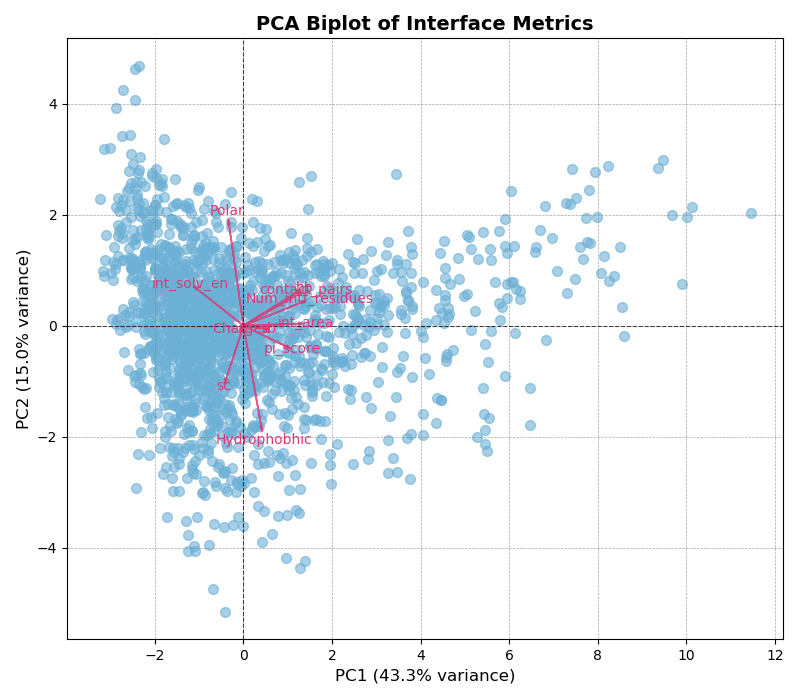
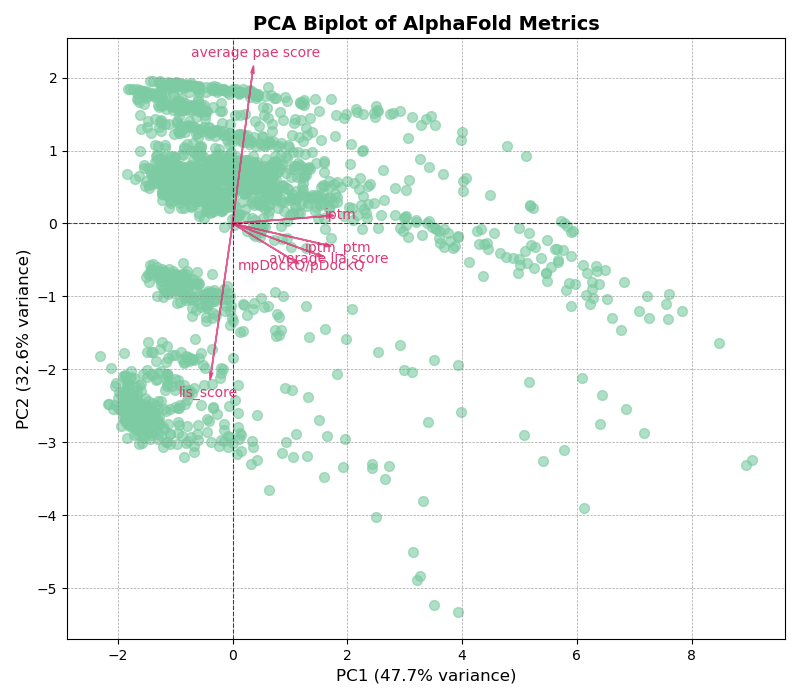
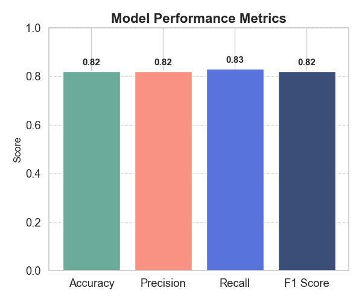
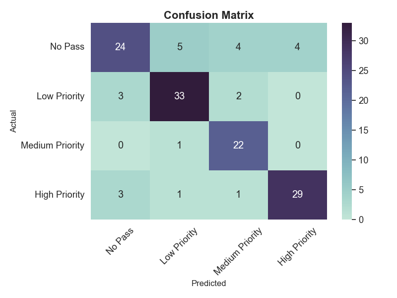
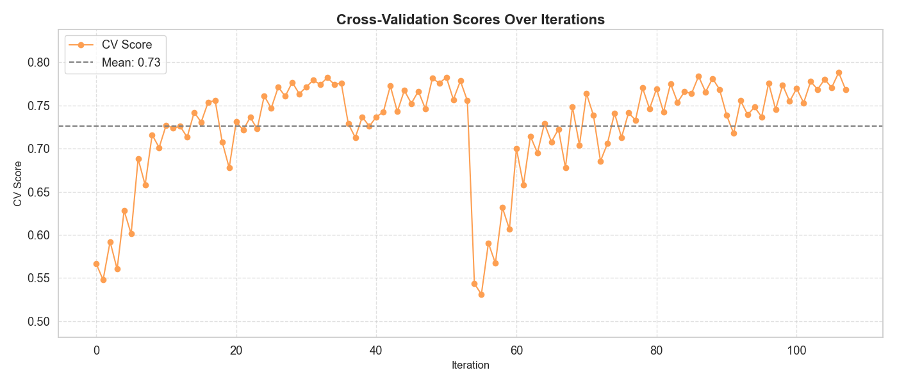

# Variation 3: XGBoost Trained Model
Using the knowledge on Variation 2, we decided to create a trained model. Variation 2 was adequate in determining what is **not** a DNF, but struggled to correctly predict the correct DNFs. To increase precision, we developed a *XGBoost Trained Model.* XGBoost, Extreme Gradient Boosting, is a gradient boosted decision tree which is best used for regression, classification, and ranking problems (2). In our case, we aim to classify and rank the different fragments into **high, medium, and low** priority fragments. 

Before training the model, we had to clean our data (1). Our data is based off the Cell Systems Methods paper on Protein Tiling-- *Peptide-tiling screens of cancer drivers reveal oncogenic protein domains and associated peptide inhibitors* (3). However, due to the way we tiled the fragments and categorize them, many DNFs from the original data are small interacting areas within the fragment, making classifcation more difficult due to the low signal-to-noise ratio

Classification of fragment is based on the percentage of similar amino acids to the original DNF fragment:

High: +95%

Medium: 75-95%

Low: 50-75%

With this in mind, our dataset was cleaned in two ways:
1. We took out proteins that have small regions of DNFs from the original dataset out
2. Fragments that score less than an average of 60% in Variation 1 and Variation 2

By cleaning the dataset, we hypothesized that the model will have a stronger predictive power in terms of accuracy and precision. To look at the trained dataset, [click here](library.xlsx)

Based on performances from Variations 1 and 2, ipTM, alone, had the best average accuracy and percision; thus, we decided to use it as the threshold to lower the noise. 

 

```python
# Filter features based on thresholds
def filter_features(data, thresholds):
    for feature, threshold in thresholds.items():
        data = data[data[feature] >= threshold]
    return data
...
thresholds = {'iptm': 0.5
    }
filtered_data = filter_features(data, thresholds)
```

## Dependencies to Download
To download the dependencies, [click here](xgboost.yml)

## The model itself:
### Model 


The Trained XGBoost Model classifies different fragment-full protein (protein-protein) interaction into high, medium, and low priority dominant negative fragment. 


**1. Threshold**

The model was trained on a clean dataset that was described above. To increase the signal to noise ratio, we continued to filter the data using ipTM. As stated above, the ipTM filter constantly yielded the highest average accuracy across Variation 1 and 2 for predicting DNFs.

```python
# Filter features based on thresholds
def filter_features(data, thresholds):
    for feature, threshold in thresholds.items():
        data = data[data[feature] >= threshold]
    return data
...
thresholds = {'iptm': 0.5
    }
filtered_data = filter_features(data, thresholds)
```

**2. Features**

Features that were placed in the model were based off of Principal Component Analysis; 

 

PCA highlights that about 58.3% of the variance can be explained by Interface Metrics and 80.3% of variance can be explained by AlphaFold Metrics. We specifically used the biggest magnitude vector feature as the feature that is placed into the model. PCA was done on the clean dataset after being thresholded by ipTM. Features were then normalized accordance to their own dataset of tiled and full protein.

```python
selected_features = ['Polar',
                         'contact_pairs','sc',
                         'Hydrophobhic',
                         'average pae score', 'mpDockQ/pDockQ','known_label']

# Filter the data based on the feature thresholds
    filtered_data = filter_features(data, thresholds)

    # Normalize data
    filtered_data=normalize_drop(filtered_data)

    # Select only the relevant features for training
    filtered_data = select_relevant_features(filtered_data, selected_features)
```

**3. Training the model**

The dataset was broken into a 80% training and 20% testing. Furthermore, due to the medium fragments being the minority in the sample, we added artificial data using SMOTE with the strategy of balancing all the classes. We adjusted the k_neighbors--the nearest datapoints closes to the "neighborhood" of samples used to generate the synthetic samples-- dynamically according to the number of samples in the minority class.

```python
def oversample_with_smote(X, y, strategy='auto'):
    """
    Apply SMOTE to oversample underrepresented classes.
    
    Args:
        X (array-like): Feature matrix.
        y (array-like): Labels.
        strategy (str or dict): SMOTE sampling strategy. Default 'auto' = balance all classes.
    
    Returns:
        X_resampled, y_resampled
    """
    if len(X) <= 1:
        logging.warning("Not enough samples to apply SMOTE. Returning original data.")
        return X, y

    # Count original class distribution
    class_counts = Counter(y)
    logging.info(f"Original class distribution: {class_counts}")

    try:
        # Adjust k_neighbors based on smallest class
        min_class_size = min(class_counts.values())
        k_neighbors = min(5, min_class_size - 1) if min_class_size > 1 else 1

        smote = SMOTE(sampling_strategy=strategy, random_state=42, k_neighbors=k_neighbors)
        X_resampled, y_resampled = smote.fit_resample(X, y)

        new_counts = Counter(y_resampled)
        logging.info(f"Resampled class distribution: {new_counts}")

        return X_resampled, y_resampled

    except ValueError as e:
        logging.error(f"SMOTE failed: {e}")
        return X, y

X = filtered_data.drop(columns=['known_label'])
    y = filtered_data['known_label']
    
    # Apply SMOTE for oversampling
    X_train_resampled, y_train_resampled = oversample_with_smote(X, y)

    # Now split the resampled training data into new training and test sets
    X_train, X_test, y_train, y_test = train_test_split(X_train_resampled, y_train_resampled, test_size=0.2, random_state=42)
```

**4. Hyperparameterization and Optimization**

We used a GridSearchCV to find the optimal XGBoost parameters. This allows the model to be systematically trained and evaluated dependent on each hyperparameter combination. The evaulation of this combination is through the cross validation. 

```python
    # Initialize XGBoost model
    xgboost_model = xgb.XGBClassifier(
        random_state=42,
        eval_metric='mlogloss',
        use_label_encoder=False
    )

    # Train the model
    # Define parameter grid for GridSearchCV
    param_grid = {
        'max_depth': [3, 5, 7],
        'learning_rate': [0.01, 0.1, 0.2],
        'n_estimators': [100, 200, 300],
        'subsample': [0.8, 1.0],
        'colsample_bytree': [0.8, 1.0]
    }

    # Grid Search for tuning XGBoost hyperparameters
    grid_search = GridSearchCV(estimator=xgboost_model, param_grid=param_grid, cv=5, scoring='f1_macro', n_jobs=-1)
    
    grid_search.fit(X_train, y_train)

    # Best hyperparameters
    logging.info(f"Best Parameters: {grid_search.best_params_}")

    # Evaluate the model with best hyperparameters
    best_model = grid_search.best_estimator_
    y_pred_best = best_model.predict(X_test)
```

### Model Performance
To look at the [log](training_info.log)

   



**Best Hyperparameters**: 
  - colsample_bytree: 1.0
  - learning_rate: 0.2
  - max_depth: 7
  - n_estimators: 300
  - subsample: 0.8
**Class Distribution**:
  - Original: Not Pass (0): 165, Low (1): 37, Medium (2): 24, High (3): 30
  - After SMOTE: Not Pass (0): 165, Low (1): 165, Medium (2): 165, High (3): 165

### Usage
1. Configure threshold parameters for feature filtering
2. Select relevant features for model training
3. Run the script with the path to your CSV data file
4. The model will be trained, evaluated, and saved to the specified path

To train [model](model_creation.py), and here is the [training data set](library.xlsx)

To grab a trained [model](model_xgboost_moodel.pkl)

The code to create your own predictions are based [here](prediction_dnf.py)

The way you run the code:
``` bash
python3 prediction_dnf.py -uniprot=uniprot_id -file=excel_output_name -excel=/path/to/AlphaPulldown/outputs
```

An example of the [output](../pipeline/example/flt3_version3_output.xlsx)

---
# References
[1] Ding, B., & Koutris, P., *Model selection for machine learning: The best choice is not always the most accurate.* **IEEE Data Engineering Bulletin,** 44(1), 24–33, (2021) [Paper Link](http://sites.computer.org/debull/A21mar/p24.pdf)

[2] NVIDIA, *XGBoost,* **NVIDIA,** (2025), [Link](https://www.nvidia.com/en-us/glossary/xgboost/)

[3] Ford K. et al., *Peptide-tiling screens of cancer drivers reveal oncogenic protein domains and associated peptide inhibitors,* 12(7), 716-732, (2021) [Paper Link](https://doi.org/10.1016/j.cels.2021.05.002)

[4] Yu, D. et al. AlphaPulldown—a Python package for protein–protein interaction screens using AlphaFold-Multimer, Bioinformatics, 39(1), (2023) [Paper Link](https://doi.org/10.1093/bioinformatics/btac749)
